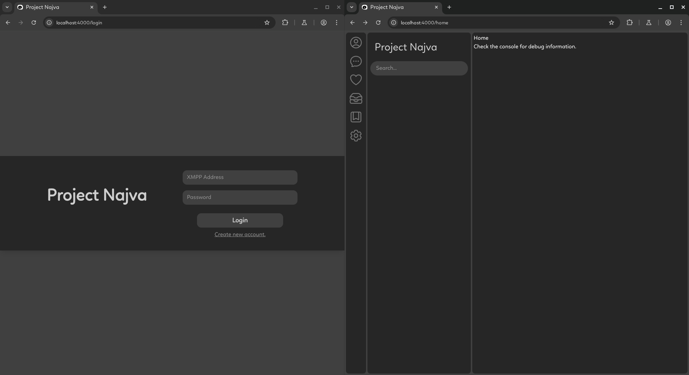
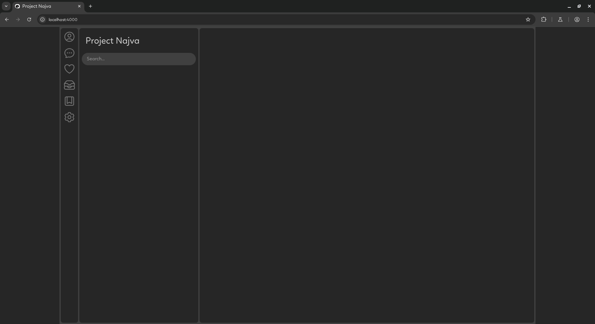

# Project Najva

**Najva** aims to become *the go-to web client for XMPP*, spreading the light of security and freedom by making XMPP more accessible — and actually usable in everyday life.

The project will remain open source, and the hope is that fellow comrade XMPP providers will host this client alongside the many free (or even paid 🤷‍♂️) servers.

All this... until the direly needed job takes away the dev guy. Then — who knows? Maybe something miraculous will happen, and Najva will survive to live a long, fulfilling life.  
Or, may dear Najva rest in peace. 🪦


## 🚧 Current State

⚠️ *Still in early development / pre-alpha.*

-  Just made sure the UI appears perfect on mobile to desktop, and everything in between.

This is a [Phoenix LiveView](https://hexdocs.pm/phoenix_live_view/) project with *no database*. The library used is [ProcessOne XMPP library](https://github.com/processone/xmpp) for Erlang/Elixir.

---

🎯 **Current Roadmap:**  
- Integrate login and display chat list.
- Display previous clean-text chats properly.
- Send clean-text messages.
- Add OMEMO, to enable secure chats.
- Implement presence.


### **First Look:**





---

## 🛠️ Installation

### Prerequisites

- Elixir
- Erlang

Make sure both are installed and available in your system's PATH.

### Steps

1. Clone or download this repository.
2. Navigate to the project directory.
3. Run the following commands:

```bash
mix deps.get
mix phx.server
```

### ⚠️ Common Issues

You might run into a few errors related to missing OpenSSL or some C libraries, depending on your system setup.
Don’t panic — just copy the error and paste it into your AI assistant (like GitHub Copilot, ChatGPT, etc.).
With a few terminal commands, things should be up and running smoothly.

### ✅ Access

Once the server starts, visit:

http://localhost:4000